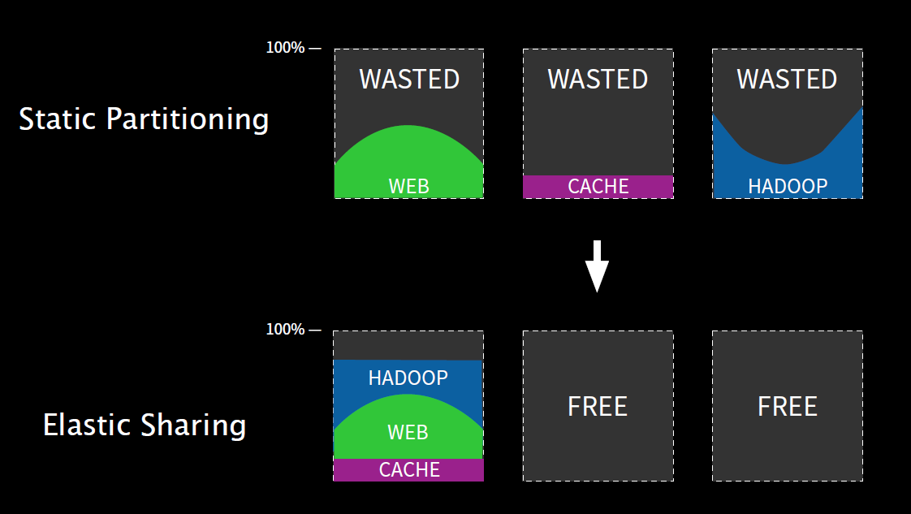

# Description

Orcheration Docker with Mesos/Marathon/Demios

# Intro

## About Mesos

### Applications in the Cloud Era


### From Static Partitioning to Elastic Sharing



## Tested Physical Env.

* OS: Ubuntu 12.04.4 LTS amd64 (3.11.0-15-generic / 8Cores / 8GB RAM)
* Vagrant: 1.6.5
* VirtualBox: 4.3.18 r96516 (/w Oracle VM VirtualBox Extension Pack)

## Mesos Env.

* One Mesos Master Node
  * Mesos-Master
  * Marathon
  * Zookeeper
* Two Mesos Slave Nodes
  * Mesos-Slave
  * Docker
  * (Note) Edit "num_slave_nodes" in Vagrantfile
* Parameters in Vagrantfile
  * master_ip
  * use_deimos : default is "false"
  * use_mesos_dns : default is "true"
  * docker_bip : default is "172.17.42.1"
  * mesos_dns_conf_ttl : default is "60"
  * mesos_dns_conf_port : default is "53"
  * mesos_dns_conf_domain : default is "mesos"
  * use_weave : default is "false"

## ScreenShots

### Mesos UI


### Marathon UI (1)


### Marathon UI (2)


### Marathon UI (3)


## HowTo

```bash
host> vagrant up
```

### Mesos Web-UI

```
Browser> http://{Vagrant-Host-IP}:5050
```

### Marathon Web-UI

```
Browser> http://{Vagrant-Host-IP}:8080
```

### Chronos Web-UI

```
Browser> http://{Vagrant-Host-IP}:4400
```

## APPENDIX

### Example API

#### e.g. Creating Marathon Task

```bash
curl -X POST -H "Accept: application/json" -H "Content-Type: application/json" localhost:8080/v2/apps -d '
{
  "id": "bridged-webapp",
  "cmd": "python3 -m http.server 8080",
  "cpus": 0.1,
  "mem": 64.0,
  "instances": 2,
  "container": {
    "type": "DOCKER",
    "docker": {
      "image": "python:3",
      "network": "BRIDGE",
      "portMappings": [
        { "containerPort": 8080, "hostPort": 0, "servicePort": 9000, "protocol": "tcp" },
        { "containerPort": 161, "hostPort": 0, "protocol": "udp"}
      ]
    }
  },
  "env": {
    "FOO": "foo",
    "BAR": "bar"
  },
  "constraints": [
    [
      "hostname",
      "UNIQUE"
    ]
  ]
}
'
```

#### e.g. Mesos-DNS Query

* Ref: http://mesosphere.github.io/mesos-dns/docs/naming.html

##### A Records

* An A record associates a hostname to an IP address. For task task launched by framework framework, Mesos-DNS generates an A record for hostname task.framework.domain that provides the IP address of the specific slave running the task.

```bash
# dig bridged-webapp.marathon.mesos A

; <<>> DiG 9.9.5-3-Ubuntu <<>> bridged-webapp.marathon.mesos A
;; global options: +cmd
;; Got answer:
;; ->>HEADER<<- opcode: QUERY, status: NOERROR, id: 47141
;; flags: qr aa rd ra; QUERY: 1, ANSWER: 2, AUTHORITY: 0, ADDITIONAL: 0

;; QUESTION SECTION:
;bridged-webapp.marathon.mesos.	IN	A

;; ANSWER SECTION:
bridged-webapp.marathon.mesos. 60 IN	A	192.168.10.51
bridged-webapp.marathon.mesos. 60 IN	A	192.168.10.52

;; Query time: 2 msec
;; SERVER: 192.168.10.11#53(192.168.10.11)
;; WHEN: Wed Mar 11 02:13:51 UTC 2015
;; MSG SIZE  rcvd: 137
```

##### SRV Records

* An SRV record associates a service name to a hostname and an IP port. For task task launched by framework framework, Mesos-DNS generates an SRV record for service name _task._protocol.framework.domain, where protocol is udp or tcp.

```bash
# dig _bridged-webapp._tcp.marathon.mesos SRV

; <<>> DiG 9.9.5-3-Ubuntu <<>> _bridged-webapp._tcp.marathon.mesos SRV
;; global options: +cmd
;; Got answer:
;; ->>HEADER<<- opcode: QUERY, status: NOERROR, id: 35551
;; flags: qr aa rd ra; QUERY: 1, ANSWER: 4, AUTHORITY: 0, ADDITIONAL: 0

;; QUESTION SECTION:
;_bridged-webapp._tcp.marathon.mesos. IN	SRV

;; ANSWER SECTION:
_bridged-webapp._tcp.marathon.mesos. 60	IN SRV	0 0 31000 bridged-webapp.marathon.mesos.
_bridged-webapp._tcp.marathon.mesos. 60	IN SRV	0 0 31001 bridged-webapp.marathon.mesos.
_bridged-webapp._tcp.marathon.mesos. 60	IN SRV	0 0 31000 bridged-webapp.marathon.mesos.
_bridged-webapp._tcp.marathon.mesos. 60	IN SRV	0 0 31001 bridged-webapp.marathon.mesos.

;; Query time: 5 msec
;; SERVER: 192.168.10.11#53(192.168.10.11)
;; WHEN: Wed Mar 11 02:15:08 UTC 2015
;; MSG SIZE  rcvd: 389
```
